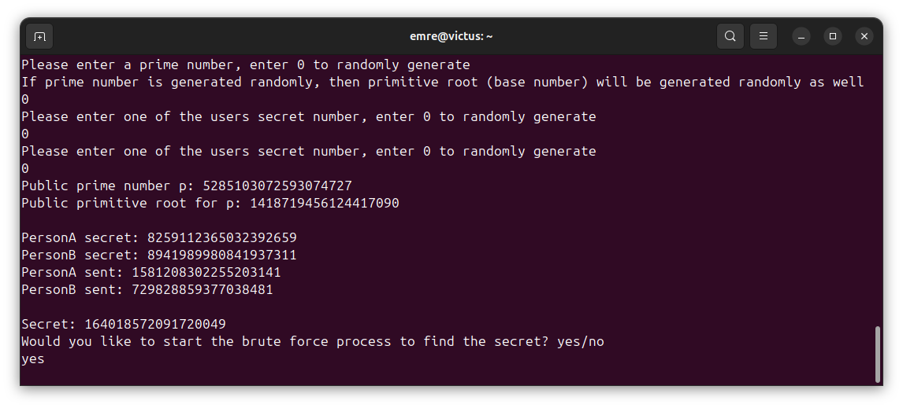

# Diffie-Hellman Key Exchange Program
Author: Ali Emre Karatopuk

This program was developed as part of the **Secure Programming** course assignment. It allows users to explore the **Diffie-Hellman key exchange** process as it shows how two parties can securely generate a common secret over an insecure channel.

A concise explanation of the Diffie-Hellman algorithm can be found [here](https://www.geeksforgeeks.org/computer-networks/implementation-diffie-hellman-algorithm/).

### Notes

* This program operates within **64-bit unsigned integer limits** (`ulong`).
* The 64-bit limitation was explicitly set by the **Secure Programming** course as part of the assignment requirements.
* As a result, while the program shows the Diffie-Hellman key exchange process, it is intended for **only educational purposes** and should not be used for real-world cryptographic security.

## Overview of the Diffie-Hellman Key Exchange Steps

The following steps outline how the program demonstrates the Diffie-Hellman key exchange process.

### Step 1: Public Parameter Generation

The Diffie-Hellman key exchange requires two public parameters:

* **Prime number (`p`)**: Used as the modulus in all calculations.
* **Base number (`g`)**: A primitive root modulo the chosen prime number, also called the **generator**.

These parameters can either be provided by the user or generated randomly by the program.

### Step 2: Primality Tests

To guarantee that the prime number is valid, the program performs two primality tests:

* [Sieve of Eratosthenes](https://en.wikipedia.org/wiki/Sieve_of_Eratosthenes): a quick test to eliminate numbers divisible by small primes.
* [Rabin-Miller test](https://en.wikipedia.org/wiki/Miller%E2%80%93Rabin_primality_test): a probabilistic test that confirms whether the number is *likely* prime.

If the user provides a prime number, the program verifies its validity using both tests.
If the prime number is generated randomly, the program keeps generating candidates until it finds one that passes both the Sieve of Eratosthenes and Rabin-Miller tests.

### Step 3: Base Number (Primitive Root) Verification

Once a valid prime number is available, the program determines a suitable 
**base number** (also called the generator), which must be a primitive 
root of the chosen prime. This ensures that all possible values in the 
multiplicative group modulo the prime can be generated.

* If the user provides a base number, the program verifies that it is a primitive root of the chosen prime number.
* If the user chooses the random generation option, the program continues generating candidate base numbers until it finds one that satisfies the primitive root conditions.

### Step 4: Secret Key Selection

After the public parameters (prime number and base number) are set, each party selects a secret key (also called a private number):

* The user can provide secret keys manually for both parties.
* Alternatively, the program can generate large random secret keys automatically.
* The secret keys do not need to be prime numbers.

### Step 5: Shared Secret Generation

Once the secret keys are set, the program automatically calculates the shared secret that both parties will use:

* The program computes intermediate public keys for each party by raising the base number to the power of their secret key modulo the prime number.
* The program uses each party's public key and their secret key to automatically compute the shared secret.

### Step 6: Optional Brute-Force Simulation

The program includes an optional **brute-force attack simulation** to demonstrate the difficulty of recovering secret keys from public values:

* Users can choose to attempt a brute-force attack after the shared secret has been generated.
* The program tries all possible values to recover the **secret key** of one party from the corresponding public message.
* Once the secret key is discovered, the program uses it to compute the **shared secret**.

## Custom Mathematical and Cryptographic Functions

While C# provides built-in functions for essential operations such as modular exponentiation, this assignment required reimplementing key mathematical functions from scratch.

### Modular Exponentiation (`ModPow`)

The program implements its own modular exponentiation function, `ModPow`.

Key points about this implementation:

* Supports very large exponents efficiently using the [exponentiation by squaring](https://en.wikipedia.org/wiki/Exponentiation_by_squaring), which reduces the number of multiplications.
* Handles 64-bit arithmetic safely and avoids overflow by using a combination of standard multiplication and [Karatsuba multiplication](https://en.wikipedia.org/wiki/Karatsuba_algorithm) when needed.
* Provides the foundation for computing both public keys and the shared secret in the Diffie-Hellman key exchange.

### Primality Tests

References:
* [How to generate big prime numbers](https://medium.com/@ntnprdhmm/how-to-generate-big-prime-numbers-miller-rabin-49e6e6af32fb)
* [How to generate Large Prime numbers for RSA Algorithm](https://www.geeksforgeeks.org/how-to-generate-large-prime-numbers-for-rsa-algorithm/)
* [Miller–Rabin primality test](https://en.wikipedia.org/wiki/Miller%E2%80%93Rabin_primality_test)

### Finding Primitive Roots of a Prime Number

References:

* [Finding Primitive Roots](https://en.wikipedia.org/wiki/Primitive_root_modulo_n#:~:text=many%20primes.-,Finding%20primitive%20roots,-%5Bedit%5D)

## Disclaimer

This project is intended for educational and demonstrational purposes only. The author is not responsible for any misuse or security vulnerabilities that may arise from using this code.